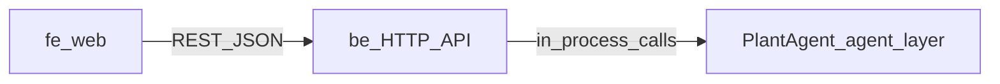

# Guyu 后端（`be/`）规划 — 职责、接口与落地步骤

本文定义 **`be/` 在全仓库中的边界**、**面向前端（`fe`）的 HTTP 契约**、**面向 `agent-layer`（`@guyu/plant-agent`）的集成方式**，以及建议的**分阶段实施顺序**。字段级 JSON 样例以契约文档为准，本文不重复粘贴完整 payload。

**路径约定：** 文中 `agent-layer/...` 均相对**仓库根目录**。

---

## 1. `be` 在全项目中的职责

Guyu 采用「前端 → 产品后端 → 领域 Agent」分层：**浏览器只与 `be` 通信**；**`be` 负责编排、持久化、上传与观测**；**`agent-layer` 只做结构化能力（分析 / 建议 / 评估），不含 HTTP 与数据库**。

| 层级 | 职责 |
|------|------|
| **`fe/web`** | UI、按结构化字段渲染、低置信度 / 失败态降级（见 [agent-handoff.md](../../../agent-layer/docs/agent-handoff.md) §6）。**不**直连 PlantAgent。 |
| **`be`（本目录，待实现）** | **对外 HTTP API**；鉴权与用户上下文（首版可占位）；**上传与 `file_id` / `url` 管理**；**落库**（植物档案、养护事件、评估与建议快照）；**调用 `PlantAgent`**；**`request_id` 生成与透传**；超时 / 重试 / 熔断；审计日志（可选存原始 Agent 响应）；**非 Agent 聚合**（节律统计、视频列表、创作者位等）。 |
| **`agent-layer`** | `PlantAgent` 三能力：`analyzeProfile`、`generateDailyAdvice`、`assessState`；输入输出为契约化 JSON。**不**承担上传、鉴权、持久化。 |

**不变量：**

- 前端**永不**直接依赖 `agent-layer` 包或其实现细节。
- **`be` 是唯一产品后端边界**：持久化与对外契约在此收敛。

---

## 2. 与前端（`fe`）的接口定义

### 2.1 数据流（概览）

### 2.2 Agent 能力对应的三个核心路由

与 [agent-handoff.md](../../../agent-layer/docs/agent-handoff.md) §2 一致；请求 / 响应体形状以对应 **service 契约** 为准。

| 方法 | 路径 | 用途 | 契约（请求 / 响应字段） |
|------|------|------|-------------------------|
| `POST` | `/v1/plants/profile:analyze` | 首次识图 → `PlantProfileDraft`，供确认与建档 | [plant-profile-service.md](../../../agent-layer/docs/contracts/plant-profile-service.md) |
| `POST` | `/v1/plants/daily-advice:generate` | 基于正式档案与上下文生成当日建议 | [daily-advice-service.md](../../../agent-layer/docs/docs/contracts/daily-advice-service.md) |
| `POST` | `/v1/plants/state:assess` | 基于图像与历史做保守状态评估 | [state-assessment-service.md](../../../agent-layer/docs/contracts/state-assessment-service.md) |

共享枚举与公共结构：[shared-schemas.md](../../../agent-layer/docs/contracts/shared-schemas.md)。

**前端消费纪律（摘要）：** 主 UI 由 `actions`（每日建议）、`overall_state` / `signals`（状态）等**结构化字段**驱动；`today_summary`、`mood_copy` 仅作摘要 / 文案，不得反推业务分支。详见 handoff §3 与 [fe/docs/plan/UPGRADE.md](../../../fe/docs/plan/UPGRADE.md) §3。

### 2.3 扩展产品接口（非 Agent，由 `be` 组装）

以下能力 **不在** PlantAgent 交付范围内（handoff §1），由 `be` 读库 / CMS / 规则聚合后暴露，字段可与前端设计稿对齐（示例见 UPGRADE §2～3）。

| 用途（示例） | 说明 |
|--------------|------|
| 单株详情聚合 | 例如 `GET /v1/plants/:plantId/home`（命名待定）：合并 `PlantProfile`、当日 `DailyAdvice`、最近一次 `PlantStateAssessment`、`CareEvent` 推导的节律指标等，减少前端多次往返。 |
| 视频推荐列表 | 元数据（标题、时长、缩略图 URL、`taxonomy_id` 过滤）来自后端或 CMS。 |
| 相似创作者 / 运营位 | 列表型只读接口；可后续再接推荐服务。 |

首版可先 **mock 固定 JSON**，再替换为真实数据源。

### 2.4 跨域与运行环境（约定）

- **开发：** `fe`（如 `http://localhost:3000`）调用 `be`（如 `http://localhost:8787`）时，`be` 需开启 **CORS**，允许前端源与常用 headers（`Content-Type`、`Authorization` 预留）。
- **生产：** 建议同源反向代理（Next 与 API 同域）或网关统一 TLS；本文不锁定域名。

---

## 3. 与 `agent-layer` 的集成定义

### 3.1 集成方式

- **进程内调用：** 在 Node 服务中 `import { PlantAgent } from "@guyu/plant-agent"`（包名见 [agent-layer/package.json](../../../agent-layer/package.json)）。对每个 HTTP 请求构造**符合契约的输入对象**，调用 `analyzeProfile` / `generateDailyAdvice` / `assessState`，将返回的 **Envelope**（见 `schemas/envelopes`）写入 HTTP 响应或经薄包装（统一外层 `request_id`、HTTP 状态码）。
- **依赖引入：** `be/package.json` 将 `@guyu/plant-agent` 列为依赖（workspace 链接如 `"@guyu/plant-agent": "file:../agent-layer"` 或 monorepo 等价方式）；CI 构建顺序：**先** `agent-layer` `npm run build`，**再**构建 `be`。

### 3.2 VisionProvider

- `PlantAgent` 构造时可注入 `visionProvider`（见 [agent.ts](../../../agent-layer/src/agent.ts)）。默认开发可使用 **Fake** 视觉实现；**生产**应由 `be` 注入真实多模态调用实现，**API 密钥与模型配置只在 `be`（或密钥管理服务）**，不写入 `agent-layer` 源码。

### 3.3 校验与契约

- 传入 PlantAgent 前的 JSON **应与契约一致**（推荐复用 `@guyu/plant-agent` 导出的 Zod schema 或等价校验），避免无效输入进入领域层。

### 3.4 Agent 状态 / 错误 → HTTP 建议映射

具体状态枚举以契约与 handoff §4 为准；以下为**实施参考**（可按团队规范微调）。

| Agent / 契约层结果 | 建议 HTTP | 前端预期 |
|--------------------|-----------|----------|
| `success`（或 profile 的 `needs_confirmation` 等业务成功态） | `200` | 正常渲染结构化字段 |
| `needs_retry` | `503` 或 `200` + body 内状态（若希望不阻断首页，可与 handoff「天气缺失仍 success」策略一致） | 提示稍后重试或降级文案 |
| `failed`（如图片不可用） | `400` / `422`（按错误码语义选择） | 展示 `message`，引导重拍 / 重试 |
| 未捕获异常 | `500` | 通用错误页 / toast |

**原则：** 与 handoff §6 **降级约定**一致——例如每日建议在上下文缺失时仍返回可消费结构，并通过 `warnings` 告知保守策略。

---

## 4. 分阶段实施步骤

每步附带目的说明，便于排期与验收。

| 阶段 | 步骤 | 目的 |
|------|------|------|
| **P0** | 初始化 `be`：Node ≥20、`package.json`、TypeScript（若选用）、HTTP 框架（Express / Fastify / Nest 择一；轻量场景可优先考虑 Fastify）、`GET /health`。 | 可部署、可探测的最小进程。 |
| **P0** | 依赖 `@guyu/plant-agent`，本地 workspace / `file:` 链接；文档或脚本约定先编译 `agent-layer`。 | 保证运行时能加载 `PlantAgent`。 |
| **P0** | 实现 §2.2 三条 `POST`，透传 Envelope；中间件统一生成 / 解析 `request_id`。 | 与前端、Agent 契约**端到端**打通（可配合 fake vision）。 |
| **P1** | 最小持久化：`Plant`、`CareEvent`、可选 `AssessmentSnapshot` / `AdviceSnapshot`；开发可用 SQLite 或内存仓，后续换 Postgres。 | `daily-advice` / `assess_state` 输入中的 `recent_care_events`、`recent_assessments` 需可追溯。 |
| **P1** | 上传：`file_id` + `url` 契约（预签名上传或网关回调占位文档）。 | 支撑识图与状态评估的图像输入，无需把二进制塞进 JSON。 |
| **P2** | 聚合接口（§2.3），例如单株 home，对齐 [UPGRADE.md](../../../fe/docs/plan/UPGRADE.md) 区块数据需求。 | 减少前端编排，稳定单株详情页数据源。 |
| **P2** | 观测：结构化日志（`request_id`、`plant_id`、能力名、耗时）；可选审计表存 Agent 原始响应。 | 联调、回放与合规。 |

---

## 5. 参考索引

| 文档 | 路径 |
|------|------|
| Agent 对接说明 | [agent-layer/docs/agent-handoff.md](../../../agent-layer/docs/agent-handoff.md) |
| 前端升级与区块 ↔ 接口映射 | [fe/docs/plan/UPGRADE.md](../../../fe/docs/plan/UPGRADE.md) |
| 产品 PRD（页面与范围） | [docs/plans/2026-04-18-guyu-prd.md](../../../docs/plans/2026-04-18-guyu-prd.md) |
| PlantAgent 源码入口 | [agent-layer/src/agent.ts](../../../agent-layer/src/agent.ts) |

---

## 一句话总结

**`be` 对外提供产品 HTTP API 与持久化，对内通过 `@guyu/plant-agent` 调用三能力；扩展能力由 `be` 聚合非 Agent 数据；实施顺序为先打通三路由与健康检查，再落库与上传，最后聚合页与观测。**
