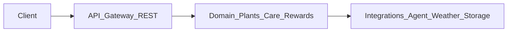

# 谷雨研究稿与 PRD 整合方案

在坚持 [2026-04-18-guyu-prd.md](./2026-04-18-guyu-prd.md) 为主产品路线的前提下，本文将 [谷雨项目优化方案.md](../research/谷雨项目优化方案.md) 中可迁移的工程方法、体验原则与可选视觉技术，映射到后端 TypeScript 服务与（由他人负责的）前端模块分工，并显式标出与黑客松「纯离线」红线不可混用的部分。

## 已阅读的文档范围

| 路径 | 作用 |
|------|------|
| [docs/research/谷雨项目优化方案.md](../research/谷雨项目优化方案.md) | 黑客松「互动空间」离线、&lt;8MB、文本种子 + L-System + WebGL 的降维方案 |
| [docs/plans/2026-04-18-guyu-prd.md](./2026-04-18-guyu-prd.md) | 谷雨主 PRD：联网识别、天气、日历、成长与 3D、抖音视频 |
| [agent-layer/docs/agent-handoff.md](../../agent-layer/docs/agent-handoff.md) | PlantAgent 三能力与建议 API、字段、降级约定 |
| [agent-layer/docs/contracts/](../../agent-layer/docs/contracts/) | 结构化契约：`shared-schemas.md` 与能力契约（与 handoff 对齐） |

---

## 一、研究稿与 PRD 的「结合点」（可落地映射）

以下结合**不**改变 PRD 的主链路（上传识别、天气、首页建议、成长记录、视频页），只吸收研究稿中**与联网产品兼容**的部分。

### 1. 体验与叙事（弱耦合）

- **情感外化 / 树洞叙事**：研究稿强调「未寄出的信 → 可视化回馈」。PRD 与 PlantAgent 中 `generate_daily_advice` 输出里的 `mood_copy` 已是「治愈系短文案」位；可在**文案与运营策略**上与「树洞、工位、节气谷雨」关键词对齐，由 Agent 提示词或模板生成，**不**要求改成离线哈希种树。
- **无惩罚、正向循环**：研究稿「植物永生、无任务失败」对应 PRD 成长页与提醒：后端与 Agent 侧应避免用「惩罚性」状态机；`assess_state` 已限制为保守白名单、禁止强诊断，与研究稿「安全感」一致。

### 2. 工程与协作方法（强推荐，全栈 TypeScript 适用）

- **PRD / 契约锚定**：研究稿要求单一技术边界文档、禁止范围蔓延；应以 PRD + [agent-handoff](../../agent-layer/docs/agent-handoff.md) 与 [agent-layer/docs/contracts/](../../agent-layer/docs/contracts/) 为需求源，接口形状对齐建议路径（`POST /v1/plants/profile:analyze` 等）。
- **垂直切片交付**：研究稿「按步骤拆 L-System / Shader / 音频」的方法可迁移为后端切片顺序见本文 **「七、后端建议实现顺序」**。
- **性能与资源生命周期**：研究稿的 `dispose()`、合并几何，**仅当** PRD「成长页 3D / 伪 3D」采用 WebGL/Three.js 时由前端参考；与后端无直接耦合。

### 3. 「程序化生成」与 PRD 3D 模块的**可选**结合

- PRD §3.3 / §4.3 允许「单植物 3D 或伪 3D、不稳定则兜底」。研究稿的 **L-System + 哈希种子** 可作为**一种**轻量伪 3D/程序化视觉方案（确定性、体积小），用于**展示层**，需满足：资源仍由产品 CDN/包内加载，**不**依赖赛道级「零网络」假设。
- **边界**：研究稿的完整「单文件离线 &lt;8MB」打包策略**不作为** Guyu 主产品约束；若只做 App/Web 产品，以正常构建与分包为准。

---

## 二、研究稿与 PRD 的「不可结合点」

| 研究稿约束 | PRD 要求 | 结论 |
|------------|----------|------|
| 禁止 fetch/XHR/WebSocket、无外部资源 | 天气、识别 Agent、视频流、上传 | **主产品不能采用** 研究稿的离线红线；二者仅能在「独立子项目 / 黑客松演示包」中共存 |
| 核心玩法 = 文本 → 本地树 | 核心 = 拍照识别 + 养护 + 日历 + 视频 | **不能**用研究稿替代 PRD 主功能；最多做营销 Demo 或彩蛋 |
| Tone.js 全本地音效 | 未在 PRD 中定义 | 可选增强，非后端职责 |

---

## 三、后端模块升级（TypeScript，对齐 PRD + handoff）

建议按**分层**组织，每层只解决该层问题（与 handoff §2、§8 一致）。

1. **API 层（HTTP，TypeScript）**  
   - 实现 PRD §4.4 核心接口：上传、识别、建档、首页、每日记录、成长、奖励、视频推荐。  
   - 与 Agent 对齐的三个路由建议直接映射 handoff：`profile:analyze`、`daily-advice:generate`、`state:assess`。  
   - 横切：`request_id`、鉴权、超时/重试/熔断、审计日志。

2. **领域与持久化**  
   - 实体：`User`、`Plant`（草稿 vs 已确认档案）、`CareEvent`、`DailyRecord`、`Reward`、`Assessment` 快照等。  
   - 规则：识别结果未确认前不升为正式 `PlantProfile`；`recent_care_events` 持久化后喂给 `generate_daily_advice`。

3. **集成层**  
   - **PlantAgent 客户端**：结构化 JSON 进出；缓存键如 `plant_id + date`（handoff）。  
   - **天气**：与 `weather_snapshot` 组装进 `today_context`；缺失时仍返回 success + warnings（handoff 建议）。  
   - **对象存储**：`file_id` / URL 与上传接口一致。

4. **显式非目标（避免 scope creep）**  
   - handoff 已写明 Agent **不**负责：上传、鉴权、库表、前端、3D 重建、视频推荐、奖励逻辑——这些**全部由后端/其他角色实现**，Agent 只提供三段结构化能力。

---

## 四、前端模块升级（非主责；按 PRD 实现，与研究稿的关系）

- **主路径**：PRD §4.1 页面与交付物 — 首页、识别、成长、视频；对接后端而非直连 Agent。  
- **结构化消费**：严格按 handoff「前端直接消费字段」：`actions` 驱动 UI，不从 `today_summary` 反推逻辑；低置信度/降级 UI。  
- **与研究稿的交集（可选）**：若成长页采用 WebGL，可借鉴研究稿的合并几何、实例化草地、像素比上限、`dispose`；若采用 L-System 彩蛋，需单独模块开关，避免与主业务混淆。  
- **扩展说明**：更细的「当前前端方案 + 可叠加新设计」见 [agent-layer/docs/UPGRADE.md](../../agent-layer/docs/UPGRADE.md)。

---

## 五、契约与 handoff 的关系

- **行为规范与完整说明**以 [agent-layer/docs/agent-handoff.md](../../agent-layer/docs/agent-handoff.md) 为准（含降级、审计、前后端职责）。  
- **字段形状与枚举**以 [shared-schemas.md](../../agent-layer/docs/contracts/shared-schemas.md)、[plant-profile-service.md](../../agent-layer/docs/contracts/plant-profile-service.md)、[state-assessment-service.md](../../agent-layer/docs/contracts/state-assessment-service.md) 为准；`generate_daily_advice` 的请求响应示例见 handoff §3.2（仓库未单独拆分时以 handoff 为源），便于 TypeScript 类型生成与评审。

---

## 六、一句话总结

研究稿贡献的是**叙事调性、垂直切片与程序化视觉的可选技法**，PRD + PlantAgent handoff 才是**联网 AI 养护助手**的主架构；后端按 TypeScript 分层落实 PRD 接口与 Agent 三能力，前端以 PRD 为主、仅选择性吸收研究稿中的 WebGL/程序化展示经验。

---

## 七、后端建议实现顺序（垂直切片）

以下为推荐联调顺序，与 PRD 主链路与 handoff §8 一致；每一步可独立验收后再进入下一步。

1. **鉴权与上传**：用户身份、`file_id` / URL、存储与上传接口稳定。  
2. **`profile:analyze` 与建档**：`POST /v1/plants/profile:analyze` → PlantAgent `analyze_profile`；草稿确认后落库为正式 `PlantProfile`。  
3. **`daily-advice`**：`POST /v1/plants/daily-advice:generate`，持久化 `recent_care_events`，组装天气与日期上下文。  
4. **`state:assess`**：`POST /v1/plants/state:assess`，与时间轴、历史评估关联存储。  
5. **首页聚合与缓存**：按 `plant_id + date` 等策略缓存每日建议；聚合天气、今日摘要、植物列表；视频推荐与奖励在 Agent 能力之外由本服务编排。
